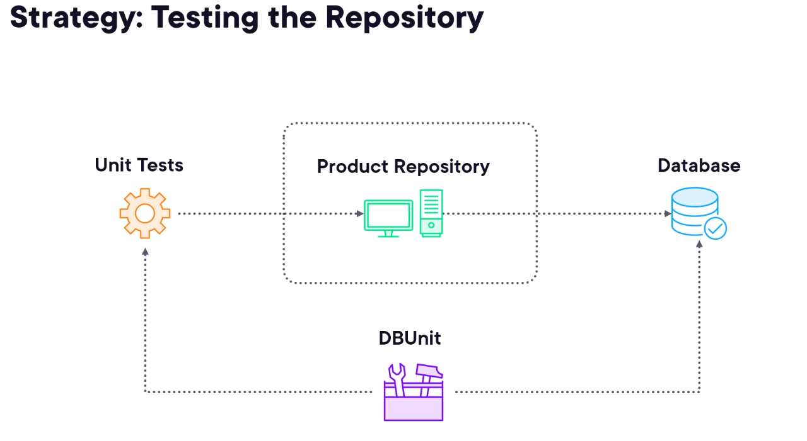

# Spring-TDD
An E-Commerce project in Spring using the Test Driven Development (TDD) approach

# Spring boot support for Unit testing
- SpringBootTest : Loads the Spring Application context into tests
- MockMvc : Comprehensive testing for Spring controllers
- MockBean : Mockito Integration

# Third party extensions for Back-end resources
- DBUnit : Prepopulate & clean up database between tests
- MongoDB : Custom extension to manage MongoDB
- WireMock : Simulate third-party API responses

# Architecture
Typical Microservice:

    [Controller ----> Service ----> Repository] ----> [Database]

# Integration Testing

# Testing the Controller

- Role of a Controller

- MockMvc features

# Testing the Service

- Role of a Service

# Testing the Repository

- Strategies

- DBUnit & DBUnitExtension

- Mock Database creation using YAML
